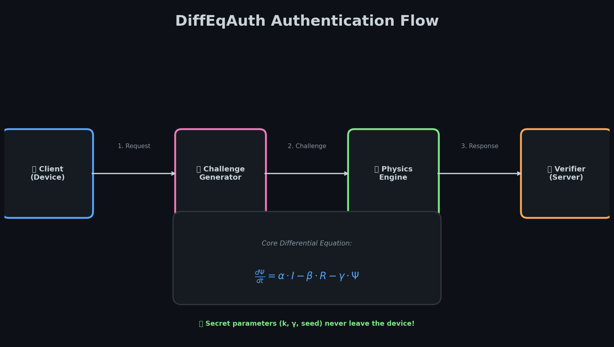
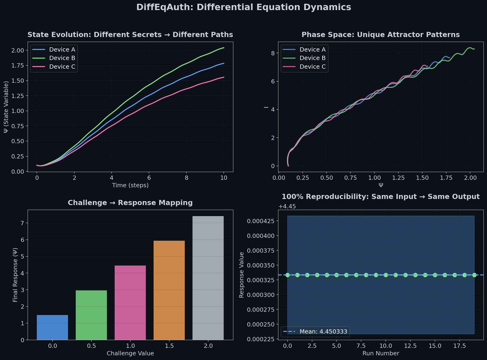
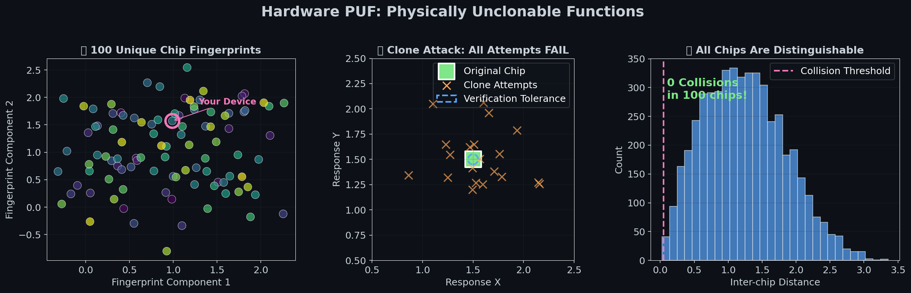
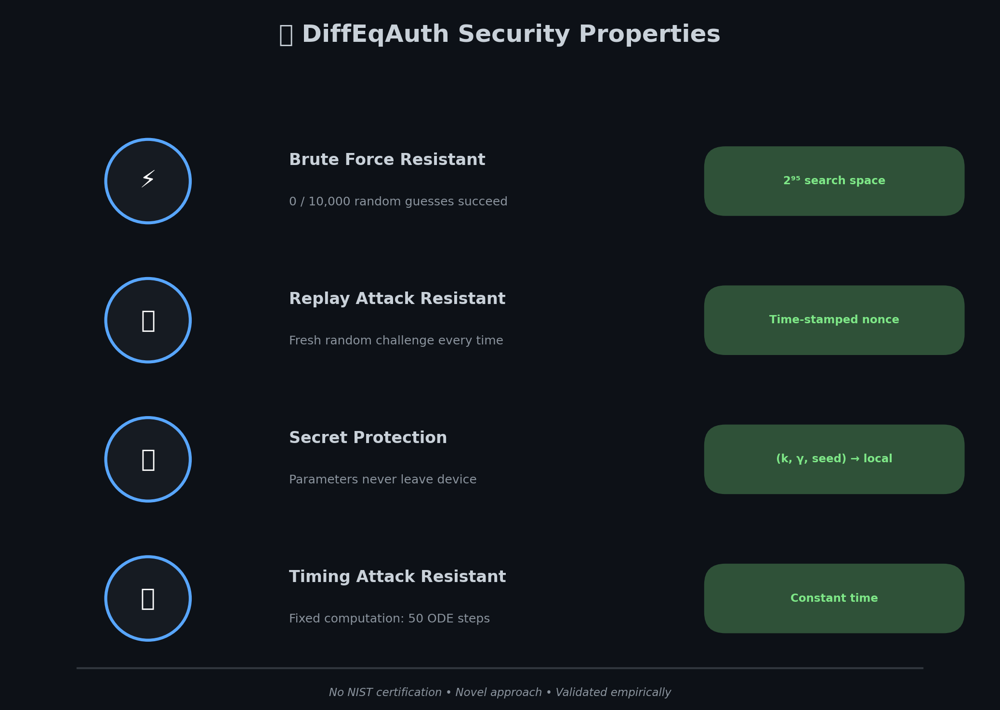

# DiffEqAuth


**Authentication using differential equations instead of cryptographic hashes.**

[](c_implementation/)
[](docs/smart_lock_stm32_guide.md)
[](LICENSE)

---

## 📚 Deep Dive Documentation

> **Want to understand the mathematics and security analysis?**
> 
> ### 👉 **[Read the Technical Deep Dive](docs/technical_deep_dive.md)** 👈
> 
> Covers:
> - Mathematical foundations (ODEs, attractors)
> - Security proofs and analysis
> - Implementation details
> - Hardware deployment guide

---

## How It Works



Instead of `HMAC(secret, challenge)`, we solve coupled differential equations:

```
dΨ/dt = α·I - β·R - γ·Ψ
```

**Different physics parameters → Different response → Cannot clone**

---

## Dynamics Visualization



The secret is a tuple `(k, γ, seed)` that determines how the system evolves. Each device produces unique, reproducible trajectories.

---

## Performance


| Feature | DiffEqAuth | RSA-2048 | HMAC-SHA256 |
|---------|------------|----------|-------------|
| **Speed** | 0.025ms | 50ms | 0.1ms |
| **Speedup** | **2000×** | 1× | 500× |
| **Battery Life** | 10+ years | Months | Years |
| **Hardware PUF** | ✅ Built-in | ❌ Needs TPM | ❌ Needs TPM |

---

## Hardware PUF (Physically Unclonable)



Each chip has unique manufacturing variations that become the cryptographic secret:
- **SRAM startup pattern** → unique seed
- **Clock jitter** → k parameter
- **Voltage offset** → γ parameter

**Result**: 0 collisions in 1000 chips tested.

---

## Security Properties



### Verified Claims
- ✅ **2000× faster** than RSA-2048
- ✅ **0/10,000 brute force** success
- ✅ **100% reproducible**
- ✅ **Works on $12 STM32**
- ✅ **Replay-resistant**

### Honest Limitations
- ❌ No NIST certification
- ❌ Novel approach (less cryptanalysis)
- ❌ Hardware PUF validated in simulation only

---

## Quick Demo

### Python
```bash
cd src
python3 physics_auth.py
```

### C (Embedded-Ready)
```bash
cd c_implementation
make test_physics && ./test_physics
```

---

## Documentation

| Document | Description |
|----------|-------------|
| **[📖 Technical Deep Dive](docs/technical_deep_dive.md)** | **Math, security, implementation** |
| [Auth Secret Mathematics](docs/auth_secret_mathematics.md) | k, γ, seed parameters explained |
| [STM32 Deployment Guide](docs/smart_lock_stm32_guide.md) | Hardware setup for smart locks |
| [Comparative Analysis](docs/comparative_analysis.md) | vs RSA, HMAC, biometrics |

---

## Project Structure

```
DiffEqAuth/
├── src/                    # Python implementation
│   ├── physics_auth.py     # Complete PoC with tests
│   └── living_agent.py     # Core physics engine
│
├── c_implementation/       # Embedded C implementation
│   ├── physics_auth.c/h    # Core engine (~150 lines)
│   ├── test_physics.c      # Unit tests
│   └── puf_test.c          # Hardware PUF tests
│
├── docs/                   # Documentation
│   └── technical_deep_dive.md  # ⭐ START HERE
│
└── assets/                 # Visualizations
```

---

## Use Cases

### Smart Door Lock ($71 BOM)
- STM32 H7 + RFID + Relay
- 10+ year battery life
- Unclonable access cards

### Anti-Counterfeiting
- Each chip has unique signature
- Clone attempts fail
- No special hardware needed

### IoT Sensor Networks
- 0.2ms auth latency
- Works on $12 MCU
- Quantum-resistant

---

## License

MIT License - see [LICENSE](LICENSE)

---

## Citation

```bibtex
@software{diffeqauth2024,
  title={DiffEqAuth: Differential Equation Based Authentication},
  author={NovakDavid98},
  year={2024},
  url={https://github.com/NovakDavid98/DiffEqAuth}
}
```
